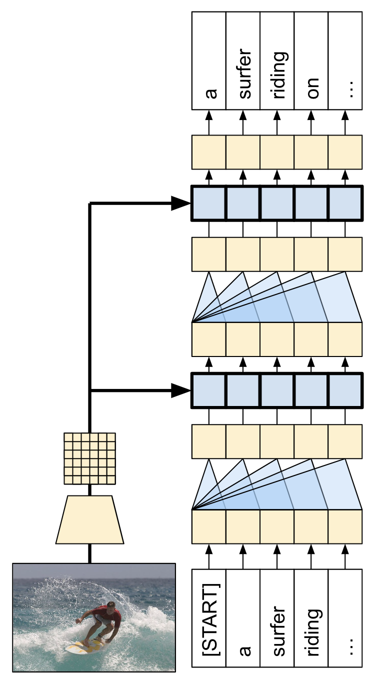
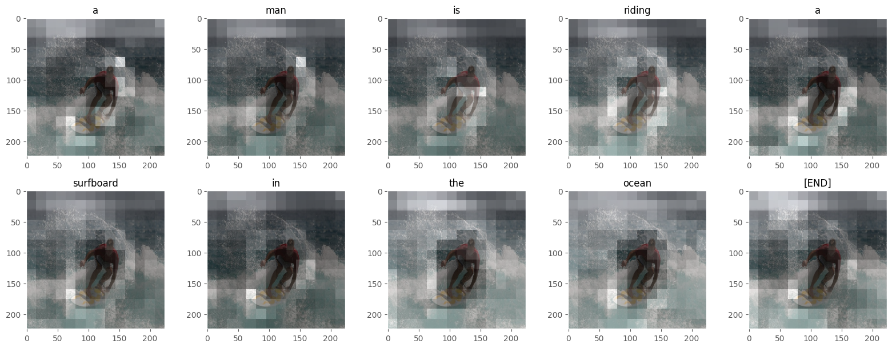

# Image-Captionning-with-Visual-Attention
Given an image, the goal is to generate a caption 
The model uses Spatial attention to focus on relevant parts of the image when generating each token.

## Model Architecture
The model architecture built in this tutorial is shown below.
Features are extracted from the image, and passed to the cross-attention layers of the Transformer-decoder.

The transformer decoder is mainly built from attention layers. It uses self-attention to process the sequence being generated, and it uses cross-attention to attend to the image.

By inspecting the attention weights of the cross attention layers you will see what parts of the image the model is looking at as it generates words.

## Project Structure
 * `Imports and Configuration`: Setting up the environment, loading necessary libraries.

 * `Data Handling`: Loading and preprocessing the Flickr8k dataset.

 * `Feature Extraction`: Using VGG19 pre-trained model to extract image features.

 * `Model Architecture`: Building the Captioner model with CNN for image feature extraction, spatial attention, and Transformer decoder.

 * `Training`: Custom callbacks to monitor performance, loss functions, and metrics.

 * `Inference`: Generating captions for new images.

## Example

